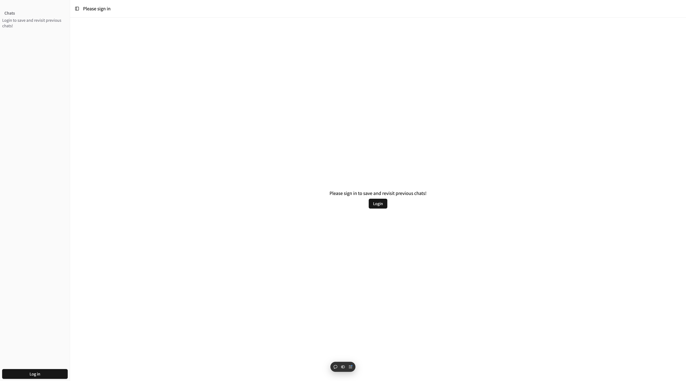
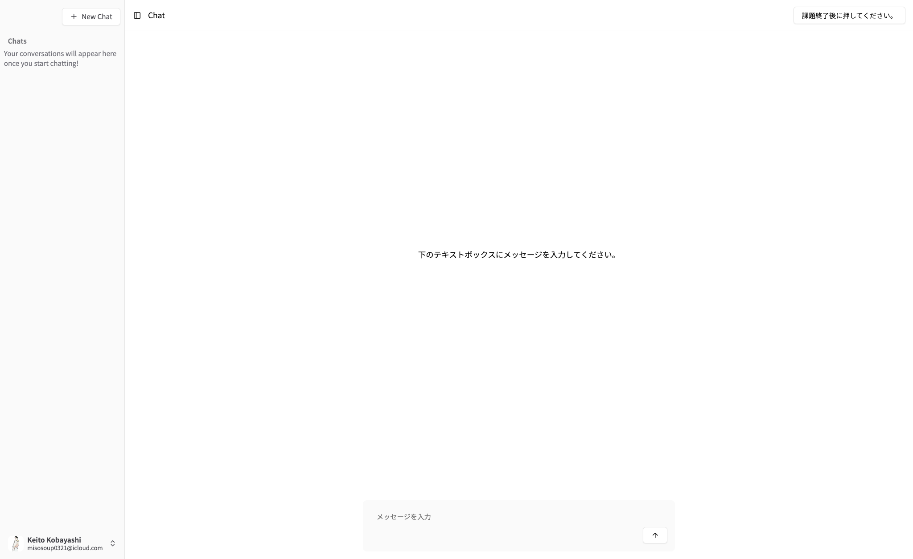

# 研究について
この課題を通して、皆さんがよく詰まるところと生成AIをどのように使うかを調査したいと思っています。

以下のリンクを開き、このサイト上の生成AIを用いて下の問題に取り組んでいただきたいです。

このサイトを通してログが解析できるようになっているため、chat gpt等の生成AIを用いないようにお願いいたします。

[AIアシスタント](https://research.bayathy.dev)

## ログイン手順
1. https://research.bayathy.dev にアクセス
2. 画面左下、もしくは画面中央のログインボタンを押す

3. github loginを求められるので、githubのアカウントでログインする


## 課題に取り組む際の注意点
- 友達に答えを教えてもらったりはせず、なるべく自力で解くようにし、わからない場合は生成AIを用いて答えを出してください。
- ログを取るため、上記のサイトを用いて課題に取り組むようにお願いいたします。

## 課題

学生のデータを管理するプログラム```main.cpp```を作成する

`main.cpp`プログラムは以下のように構成される。

- 学生のデータを管理するStudentクラス
  - 学生の名前を格納するメンバ変数 (string型)
  - 学生の年齢を格納するメンバ変数
  - 学生の学籍番号を入れるメンバ変数 (int型)

  - データをセットするメンバ関数
  - データを出力するメンバ関数
  - 学生データを入れ替えるためのコピー関数
  

- メイン関数
  - 学生のデータを入力
  - バブルソートを用いて学生を年齢が若い順に並べ替える
  - ソート後の学生のデータを出力


**入力例**
```sh
5
Taro 16 3
Hanako 12 5
Kenichi 13 1
Yuto 14 2
Koichi 11 10
```
**出力例**
```
Koichi 11 10
Hanako 12 5
Kenichi 13 1
Yuto 14 2
Taro 16 3
```

## 課題終了後
ログインした状態で、右上の「課題終了後に押してください」ボタンを押してください。
